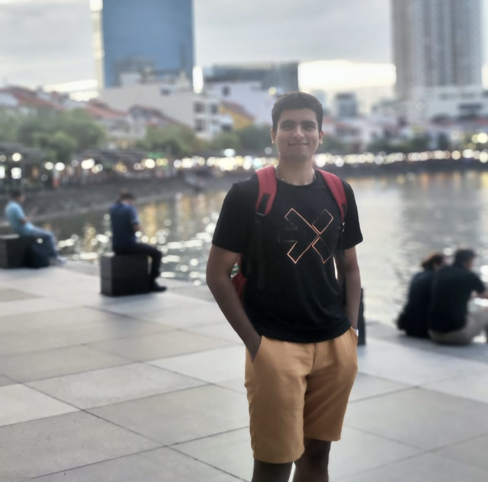

Well, it's been over six months since I last wrote a blog and a full year since I promised to make serious changes in my life. Things have been going well since then: physically, I’m in much better shape, and mentally, I’m driven without feeling guilty, so that’s a win. Over the past year, I’ve had several moments of celebration, but there’s still a feeling of incompleteness that I’d like to address. I think I’ve made some additional lifestyle changes that could be beneficial for my personal growth. While I can’t encapsulate everything that’s happened in the last eight months just yet—perhaps I’ll save that for the year-end blog—what I can do now is fast forward to today and present a new version of myself. I aim to be more regular with my upcoming blogs, a bit more unfiltered, more vocal, and happier about what I’ve accomplished, while still being as reflective about my mistakes as before.

### Present Day

I’ve joined the National University of Singapore’s School of Computing (PhD) after completing my bachelors among the best bunch of peers and friends from IIT Kharagpur. My first project is in the field of Programming Languages (PL), which is entirely new to me. My lab group has been incredibly patient with my slow adaptation to this learning curve. Although I find brainstorming interesting after such a long time, I miss the hands-on aspect of implementing and executing projects. Nevertheless, I believe that reading and conducting literature reviews are crucial parts of the learning process for junior PhDs. The field of PL is intriguing; it seems to be the only area of systems with a formal proof, though I might just be unfamiliar with other areas. Being unaware reminds me of how naive I was about research and the role of an advisor. I used to hold some ill-informed opinions about life that made me feel self-assured (perhaps overly opinionated), but I was simply naive. I can’t publicly acknowledge all of those opinions, but if I ever said something that seemed too strong or foolish, I hope you’ll forgive me. I’ve realized a lot about my previous views.
Back to Singapore—I’ve been here for a month now and am still trying to find a good social circle. The lab group is fantastic, so I spend most of my time there and then retreat to my apartment to sleep. One of the changes I’ve decided to make in this new version of myself is quitting digital media, which makes finding activities to fill my free time more challenging, except for phone calls with friends and family.
After a month here, I find myself believing more and more in destiny. The advisor and lab environment are a perfect fit for me, despite my initial concerns based on reviews from my professors. I’ve had a lot of time to reflect and realize that I need to work towards creating an impact or solving a significant problem. My advisor has extensive experience in training and is very candid with his feedback. It feels like luck to land in such an environment. While my beliefs may evolve over time, one thing I’m certain of is that I wouldn’t change any of my past experiences because they’ve all contributed to the person I am today, and I feel I have a purpose.
One area I want to work on is my social anxiety. Although I’m not an introvert, I’ve struggled with finding words or icebreakers when meeting new people lately. This might be due to a lack of social interaction recently, but I need to change that. It’s not a language barrier, but rather my own apprehensions about saying too much or whether people will understand me that hold me back.
Living in Singapore has had its inconveniences at first, especially with formalities (I just completed mine a few days ago). However, other aspects, like food and the overall student-friendliness, are very convenient. So, good night for now. I’m tired, but I think this sums up my current state. Next week, I’ll dive into more specifics—maybe about my work, goals, or other topics. Or perhaps I’ll share some thoughts on life that I might later find amusingly misguided.

Signing off \
[Aditya Ranjan Jha](https://github.com/adi4comp)