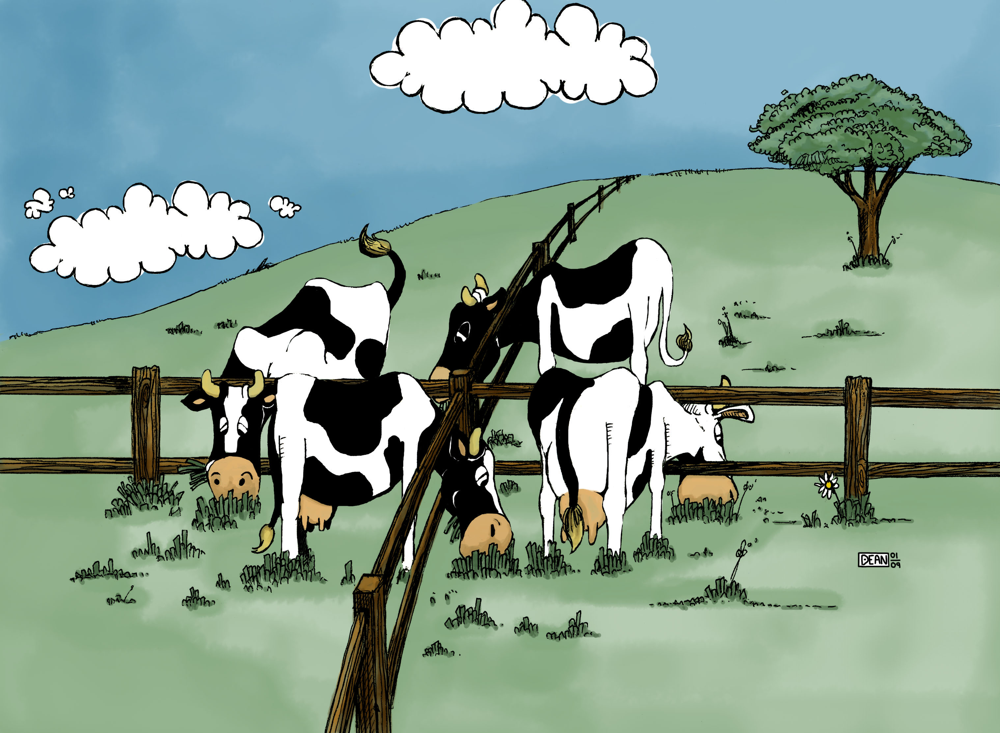

**Note: The phrase "In most cases" is implied throughout the blog**

The other day, I was returning from the lab and started evaluating if what I’m doing is right—whether it will contribute to my goals or not. I wondered, "What if I regret picking this project? What if it doesn’t turn out the way I want?" After thinking about it for a few minutes, I started reflecting on all the times in the past where I couldn’t see the road ahead clearly. Interestingly, this brought me to a larger, more abstract question that many of us have faced in one form or another: **"Do I regret making this choice, or do I just wish something had been different that could’ve made my situation better?"**

It’s a common feeling—regretting a choice and wasting time imagining alternate scenarios where things might have turned out better. We’ve all been there. In one line, you could say, "The grass is always greener on the other side." But if I were to give my analysis (and because this is my blog), here’s my take:

When we make important life choices—like deciding between two different paths—it’s natural to spend time carefully considering our options. We use our intuition, analyze potential outcomes, and try to predict what will bring us the most happiness. However, no matter how much time we spend or how thoroughly we think things through, the true outcome of our decisions is often shaped by **uncontrollable factors**—random events, external influences, and life circumstances we simply can’t predict.

Regret tends to come up when the outcome doesn’t match our expectations. But here’s the catch: no matter how much time or effort we put into the decision, we can’t fully predict the future. Our predictions are based on limited information and are often biased by our preferences. The true outcome is influenced by unknown factors beyond our control. So, the regret we feel—or the satisfaction we experience—has little to do with the decision process itself.

In the end, the **time spent making the decision** and the **methods used**—whether instinctive or analytical—become irrelevant to the final outcome. Regret, then, is often misplaced because the real factors that shaped the outcome were **unpredictable** from the start.

For example, imagine you’re in your 20s and are given a choice between leading an active social lifestyle (the "YOLO" crowd) or isolating yourself to work on self-improvement and your career (the "make an impact" kind of people). Neither path guarantees happiness. No matter what choice you make, at some point, you’ll have made a wrong move along the way. And you’ll wonder: **"What if I’d done things differently?"**

This happens because satisfaction isn’t just a function of the actual outcome. It’s **inversely proportional** to the gap between your expectations and reality. And we all know that we tend to keep raising our expectations. That’s why you’ll rarely meet someone who hasn’t thought, "Life would be better if I’d made a different choice."

If you’re going through a rough time and can’t wait for it to end, don’t challenge the universe. Things might get even worse, and you could find yourself missing the very moment you once wanted to escape. So, is it impossible to ever be happy? No, it’s not. The key is to **enjoy the process** and learn to live with whatever outcome follows. In the end, most of us realize that it all connects—you can always look back and connect the dots. If you believe that there will come a time when things are better, start telling yourself that everything makes sense now, and you’ll get there faster.

I came to this conclusion when I was optimizing my trips using public transportation to run errands. I realized that there was always a bus I could’ve caught earlier, even when I thought I’d caught the best one by running and barely making it on time. It was a self-taught lesson that helps me stop worrying about the past in most cases. Of course, I still make mistakes more often than I’d like to admit, but writing this down at least makes me feel better going into the next week.

Signing off \
[Aditya Ranjan Jha](https://github.com/adi4comp)