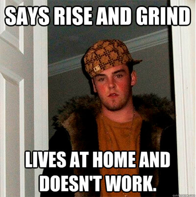

So, here’s the thing—I’ve got opinions. A lot of them. And this one? It’s a bit out there, but it’s helped me stop getting overwhelmed, so I’m sticking with it. Now, I know I’m not a native English speaker, but I’m still gonna take a crack at making this funny. So, bear with me—this is my attempt at turning my slightly weird take into something that’ll hopefully make you laugh (or at least nod along).

**Disclaimer:** *If you feel offended at any point, just know I’m not targeting you. I’m just bored on a Saturday/Sunday evening and trying to add a little sass to my blogs.*

You ever notice how everyone loves bragging about how hard they’re working? Like, hustle culture is a badge of honor now. But, have you ever stopped and thought—maybe, just maybe—they’re just not smart enough to do the work faster? I mean, come on. No one’s perfect. You probably wasted half your time googling how to do the thing you were supposed to be doing. I get it; we’ve all been there. But seriously, if everyone was that efficient, machine learning would be obsolete. Basically there'd be no field where people go, “Hey, you know what’s groundbreaking? Making the same mistake as the last model but 5% better!”

And don’t get me started on the glorification of certain habits—like coffee. It’s like a personality trait now. Every so-called genius is like, “Man, I can’t start my day without coffee. I need six cups just to function!” Really? That’s like a bodybuilder going, “Man, I can’t hit the gym without a shot of steroids—it makes me stronger!” And we’d all be like, “Umm…maybe that’s not the flex you think it is, dude.” But no, we see a guy with a laptop in one hand and a coffee in the other, and we’re like, “Wow, that’s the picture of success right there.” When really, we should be asking, “Why wasn’t he smart enough to finish his work on time and, y’know, get a full night’s sleep?” But instead, we’re all like, “Look at him! Burning the midnight oil. What a hustler.”

Isn’t it funny how we love to glorify anything that makes us feel overwhelmed? Or worse, it gives us this weird resentment for our peers, like, “Why are they getting more than what they work for?” But hold on—what if they’re just... better at managing their time? Maybe they get their work done on time, leave on time, and embrace themselves—don’t brag about it. Now, I get it. There’s another possibility: maybe they just have a different agenda. Like, let’s say you and your coworkers have a deadline coming up, and you’re thinking, “Wow, I’m definitely working harder than they are.” Well, there are two scenarios here. One, maybe they were just consistent enough to follow the timeline from the start (crazy, right?). Or two, maybe they straight up don’t care if they hit the deadline. In that case, their intent is different from yours. But what’s really funny is when people start flexing about how they’re hustling all weekend to meet the deadline. And I think the right question to ask would be, “Okay, but...what were you doing all week?”

And this isn’t just about deadlines. This is the same energy as people who brag about how they get one day a week to "actually live." Meanwhile, I’m seeing their stories every single day—humbly bragging about how hard their life is, but they’re not working either, so... maybe just go home and live your life?

Then there are the complainers. You know the type—they’ll complain when they’re unemployed, complain when they get a travel job, complain when they have a desk job. It’s like a hobby at this point. And if that’s not bad enough, now we have social butterflies bragging about how introverted they are. How is that a flex? “Dude, I just have to grind and be different from the crowd, you know? The crowd is so lame.” Well, I’ve got news for you. The crowd’s not lame—you’re just an idiot.Because while you're busy trying to be "different," the crowd’s actually out there getting things done. They’re not overthinking how to look special or bragging about their struggles. They’re just working smarter, not harder.

The internet has made us absolutely insane. Like, you’ve got people out here showing off how hard they had to work to become successful, but if you look closely, half of them were just supervising. "I had to hustle for my dreams!" No, Karen, you just sat there making sure the people actually working were doing their jobs. Meanwhile, the real hard workers? They’re the ones who stay quiet, because they don’t have time to film their ‘grind’ for social media. They’re too busy getting stuff done.

And here’s the thing: when you love what you do, it doesn’t even feel like work. It just becomes part of your life. You don’t need to be shouting about how "overwhelmed" you are, because guess what? If you keep getting overwhelmed, maybe you're just... inefficient. That’s right. You want credit for suffering, but have you ever stopped to think, “Hmm, maybe I could’ve done this faster, or better, or with less crying?” No, of course not, because then you wouldn’t get to brag about how much you “sacrificed.”

Honestly, if you’re not trying to get better at something, what’s the point of doing it over and over again? I learned to ask myself that whenever I felt overwhelmed. It became this internal voice, like, “Hey, calm down, maybe you’re just being stupid right now.”

But the funniest part? We’re all out here desperate for credit—credit for suffering, credit for hustling. So what better way to make sense of this madness than to turn it into humor? Because really, what else can you do when everyone’s out here acting like their stress is a trophy?

Signing off \
[Aditya Ranjan Jha](https://github.com/adi4comp)