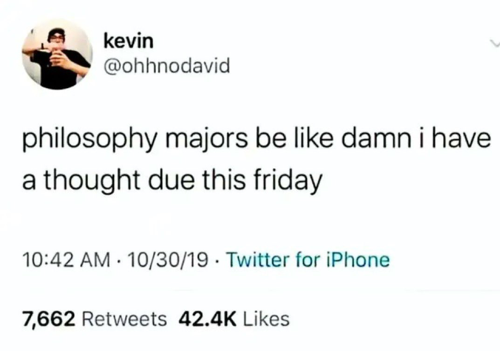

It's late, and I feel like I've messed up my time management last week. I didn't have anything concrete to write about, but for the sake of consistency—and because it'll help me remember this moment—I've decided to pen down something abstract, even a bit gloomy. Despite the tone, the realization I had about it is important.
This week, after hearing the sad news of Shri Ratan Tata's passing, I found myself reflecting on something abstract but deeply personal. I thought about his life, and suddenly, the most abstract and generic philosophy arose in my mind. It's about what happiness really is. I know there are thousands of sources that define happiness differently, and some might even mock the question. But I've realized a definition that resonates with me uniquely and personally. I also know the tone of this text might seem like I'm trying to be just another wannabe philosopher, but here it goes.

Happiness, I believe, is a fleeting period when the burdens of the past don't weigh you down, and the future holds no looming expectations. It's a moment in which you aren't wishing for something better—whether it's as brief as the joy of savoring your favorite food, or as long as a stretch of time in the past that you wish had never ended.

Looking back, one of those longer stretches of happiness for me was during the COVID lockdowns. I was with my family, safe, and everyone—including my dad—was working from home. Even though I was anxiously looking forward to future exams, I realize now that those were some of my happiest times. This contradiction is intentional because it leads to an important realization: Happiness isn't static or absolute—it's relative. A single event can carry both sadness and joy, depending on how you view it over time.

Another stretch of happiness came during the last two years, surrounded by friends, despite feeling burdened by uncertainty about my career and a tendency toward lethargy. Even though I was stuck in those feelings, I had the freedom to speak openly and enjoy the little moments with them—like our simple treks up and down the bridge near the tapri. During that time, I understood how fleeting such experiences were, knowing they would end soon. And when they did end, and I returned home, it felt like just another summer. But, I realize now how much I cherish those moments.

Since coming to Singapore, I've struggled to recreate that environment. I tried replacing those feelings with finding hobbies or by meeting new people, but nothing felt quite the same. When neither worked, I found myself clinging to the past, realizing—once again—that you can't live in those moments forever. I recalled the "canon events" those defining moments when it all started, from our first interactions to every shared memory, regardless of whether they were captured in photos.

This reflection led me to the most generic question: Can we ever be happy forever? And then the most textbook answer came to me—"Change is the only constant." It's a truth that may seem sad, but it also makes sense. Without this constant change, I wouldn't cherish the past or look forward to the future. While I can only connect the dots in hindsight, the fact that I'm reflecting on this now means I'm ready to embrace the next "canon events".

Although I still can't figure out what we're even doing in life. Running around trying to “make an impact,” while the people we actually want to keep around are… well, not around. It's like, "Congrats, you've unlocked the 'life goals' achievement! Too bad everyone you want to share it with is conveniently out of reach. Classic!" It makes you wonder—are we just collecting successes or secretly playing hide-and-seek with the universe?

I mean, sure, people say, “You'll find new people to share this with,” and that's great and all. But why does the old one have to be replaced? Sounds depressing, right? Well, don't worry, I've got plenty of free time, so I overthink all of this for you. See you next week.

Signing off \
[Aditya Ranjan Jha](https://github.com/adi4comp)