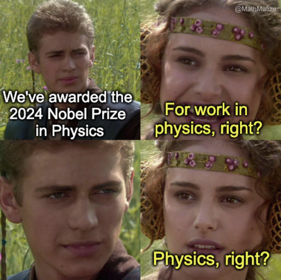

This week I learned something that feels like a superpower. It’s not easy to learn, and I don’t think there's a course for it, but it’s one of those things that, once you realize, changes how you think forever. So, buckle up—this is the introduction to some very formal lessons coming up soon.

I spent this week writing for my project, and every time I sent a draft to my advisor, I thought I’d nailed it. I mean, *masterpiece* level nailed it. I had heard my advisor was strict about scientific communication, and I’d seen how clear his course presentations were. But when I got his feedback... well, it was the same feedback everyone in the lab seemed to get. The moment I understood his point, I was both fascinated by his insight and completely embarrassed by my writing. After three rounds of edits and about a week of back-and-forth, I finally wrote... *drumroll*... two pages. Yes, two whole pages! But trust me, the mistakes and the process were invaluable lessons.

### The Reality Check: My Writing Was… Not Good

First off, I had this grand illusion that my thoughts were clear and my writing was top-notch. Yeah, no. That glass has shattered. What I thought was clarity was, in reality, a confusing mess. I realize now that this probably goes back to childhood habits. I was always a messy presenter of ideas—especially in handwritten work. I hated it so much that, as a teenager, I rarely even did my own projects. I’d ask my mom or sister to make them for me! I thought those assignments were about creativity or art. But in reality, they were teaching us how to present ideas in an organized, visual way. There are people who write answers by highlighting the key points first. And then there’s me, crafting sentences so "elegant" that the point gets lost entirely.

Thinking back, I can see why my university grades sometimes looked like crash test dummies. It wasn’t just my handwriting; my ideas were stuck in my brain and didn’t make it onto the paper. Twice, I even had professors on the verge of ripping up my answer sheets! At the time, I thought it was just about presentation or handwriting, but really, the problem was that I hadn’t written down what was actually in my head.

So, here I am, finally realizing I need to fix this. Better late than never, right? From now on, I’m making an effort to get better at scientific writing. I’m going to use my blog to convey ideas, and I’ll start sending drafts to people for feedback. I’ve learned that the core of scientific writing isn’t about showing off vocabulary (sorry, past me), but about getting ideas across clearly and directly.

### Keep It Simple (And Visual!)

The first rule of ~~fight~~ write club? Keep sentences short. (If this blog seems ironic to you, well, just know I’m still learning!) Long sentences lose the reader, and that makes total sense. Another key? Write in order. The best texts allow the reader to build context by reading each line in sequence, without jumping all over the place. And, surprise surprise, the simpler the writing, the better. If someone with no background can understand your work, you've won. Unlike literary devices, where complexity might add depth, in science, it adds confusion. The best ideas should pop up right in the beginning, so the reader doesn’t get lost in unnecessary details.

Another thing I’ve learned is about maintaining context size—each word should be an abstraction of either a well-known concept or something from your own contribution. The fewer abstractions (verbs, nouns) you use to explain your idea, the clearer it becomes. Think of it like this: it’s all about how many key words you need to describe your idea accurately. And diagrams? They’re golden. A picture really does speak a thousand words—if it’s simple enough! Diagrams should communicate ideas as cleanly and minimally as possible. If you can follow all of this, wrap things up with a strong claim to leave an impression.

Here’s the cool part: I now appreciate all the things I used to overlook. Diagrams in scientific texts, animations in videos, slides in presentations—each word spoken by a presenter has a purpose. It’s so difficult to encapsulate a whole idea in just a few minutes of talking or writing. And it’s not just short presentations—long ones are hard too, because people are more likely to zone out. The challenge is to keep their attention and communicate the core idea early.

Since joining this program, I’ve seen some excellent presentations. What stood out to me was how much time these presenters spent setting up the background. Only about 25% of the time was devoted to their actual contribution. This is exactly opposite of what our bachelor thesis presentations at KGP trained us for: spend most of the time on the results! I think the focus on results was about proving our sincerity, not the novelty of our ideas (especially since we only had 10 minutes to present).

So, yeah, this blog may not fully follow the lessons I’ve learned this week, but it’s a start. I’ll be writing more technical blogs from here on out, putting these new skills into practice. Stay tuned!

Signing off,  
[Aditya Ranjan Jha](https://github.com/adi4comp)
