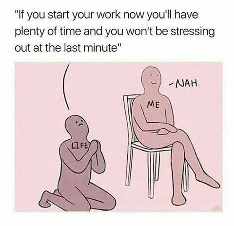

I thought about writing a technical blog, but the illusion of having too much work this week stopped me from using my time wisely. Let's talk about that.

We often feel overwhelmed by our workload. When we finish a task, we think we deserve a break. Yet, even if the workload isn't that heavy and we have plenty of time left, we still feel mentally exhausted. The brain works in funny ways!

When you have a lot on your plate, your mind races with everything you want to do when you have free time. But for me, any free time I have (the kind I'm not tracking) passes by quickly. Isn't it interesting how the semantics of time work? Time flies when you're not thinking about it. But the moment you start to pay attention, it feels like it slows down. For example, I can hear my heartbeat when running, but my eyes are glued to the treadmill timer. I'm just waiting for those 20 minutes to pass, and it feels like I've run a marathon!

Now, considering time as a dimension, general relativity tells us that time dilation occurs when moving at high speeds or being in a strong gravitational field. This is indeed a correct application of the theory. But is that all there is to it? Are there other factors influencing time dilation?

In physics, there's a concept called entropy, which helps us understand how energy spreads out and becomes less useful over time. This idea can be thought of as the "arrow of time"—as things move from order to disorder. You could say time helps determine how energy is used or wasted, even if time itself isn't consumed.

There's also the philosophical idea of eternalism, which suggests that past, present, and future all exist at once. So, rather than time "running out," every moment is just there, and our experience of moving through time is like traveling through a library of moments that are already written. When we feel like we're wasting time, it might just be our perception of moving through those moments.

In a similar vein, when we think about information, time can relate to how quickly we process and understand things. If we spend time on something unproductive, it might feel like we're wasting it—kind of like when our devices slow down, and it takes forever to get anything done. 

In quantum mechanics, there’s this idea called decoherence, where the tiny building blocks of reality interact with their surroundings, making things more predictable over time. It’s a bit like how a lively party turns into a quieter gathering as people leave; the chaos settles into order.

As I explore these ideas, I wonder if any of this is true. It’s hard to grasp, right? If time exists as a dimension, what about the rate at which it changes? If all moments in time are out there, does that mean the energy at any moment never really moves on?

The uncertainty of it all makes me skeptical. Each theory presents a compelling story, but they also raise more questions than answers. If time is an illusion, what is the reality we’re experiencing? And if our perception is merely a reflection of those timelines, can we ever truly waste it? But if we stop worrying about how much time we have or don't have, we might find that there’s enough time for everything that truly matters.

Signing off,  
[Aditya Ranjan Jha](https://github.com/adi4comp)