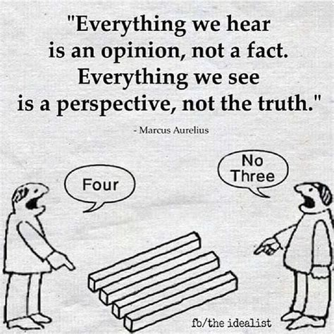

I've come to a big realization this past week: only I can truly help myself right now. It’s a lesson I've been late to fully grasp, but one that's incredibly important. Reflecting on things like ethics and navigating the "grey areas" has always been part of my thoughts, but lately, I've discovered the power of expressiveness. The grey areas, though, make it tricky to show which side you lean toward, and representing yourself accurately is tough. Without clear self-representation, others will naturally judge—and honestly, they can’t see your context, so it's logical from their perspective.

Growing up, I was taught that words are like arrows: once they’re out, they're gone. But I’ve realized words are more fluid than that—though it’s easy to forget. Comedy, too, is subjective, and what’s funny to one person can fall flat or even offend another. Take a scenario where you trip and fall: it hurts, but you laugh. Misery has its own humor. Friends I’ve had over the years kept laughing, kept joking, through good times and bad. In fact, joking about the hard stuff made it easier to deal with. But that approach doesn’t seem to resonate with everyone. The lesson? I have to think more about what I say now, because my words don’t always reflect my real intent. It’s affecting me professionally, too. My ideas don’t come through clearly, whether I’m writing or presenting. It’s not a language barrier; it’s a habit of treating words too casually.

I’ve always known I was a bit of a hypocrite, but lately, my mindset has been less rigid and more fluid. I used to be strict with my principles, hard to budge, but now I feel myself blurring lines I'd normally hold firm. Maybe it’s the hectic schedule—any free time I get, I find myself swinging to extremes. I do have time, but I'm not using it well. Why do I only think about doing things when I’m actually busy?

Recording time was one habit I had that helped. I need to start that again, but I should balance it with things that spark my interest. I'll admit it: no one can be endlessly productive. So maybe it’s time to set realistic goals instead of clinging to the fantasy of constant productivity. Yet, part of me wonders: will "realistic" goals make me feel like I didn't push myself hard enough? It’s strange, but even with ambitious goals, I'm not hitting them. Maybe the version of myself that chased discipline is what I need to restore.

Signing off,  
[Aditya Ranjan Jha](https://github.com/adi4comp)