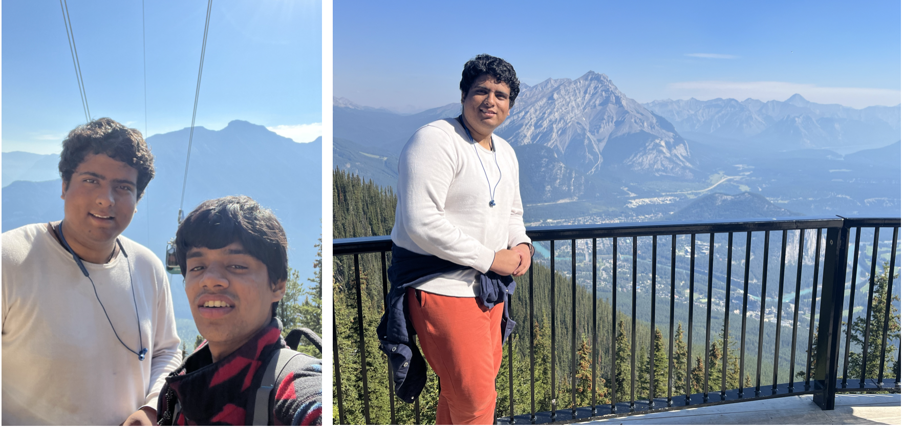
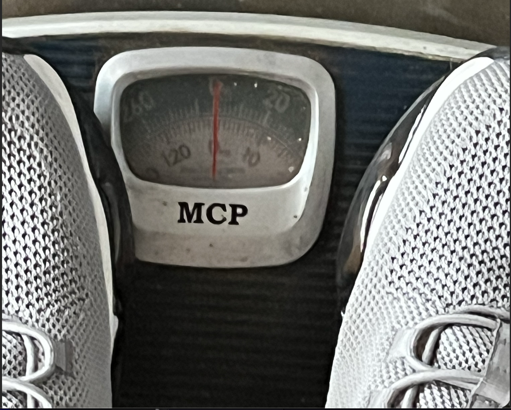
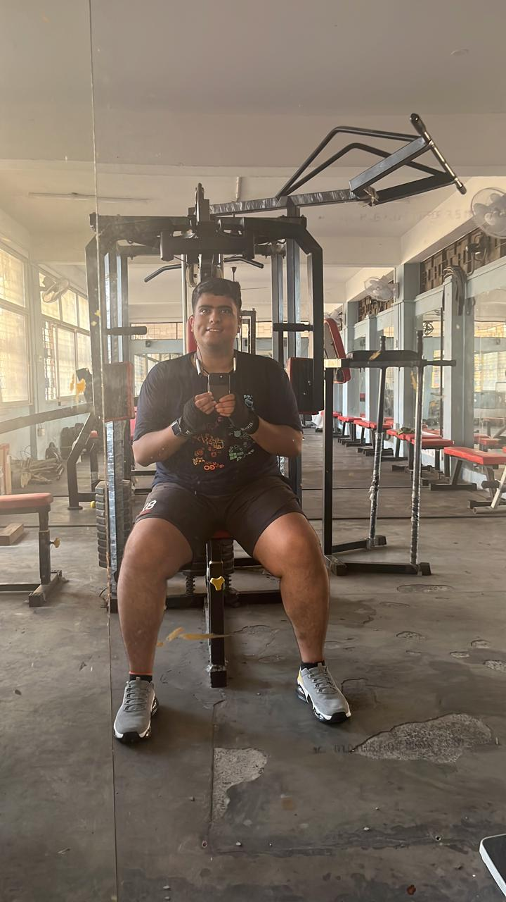
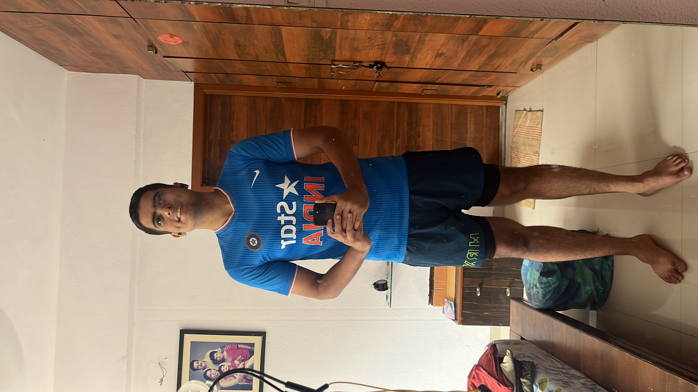

**Note:** The title is a punchline by comedian Jimmy Carr, which inspired me to write this blog

This (left) was the exact moment I realized — I need to lose weight. I started, and at every step, I thought, "I should write about this and wrap it up." But honestly, it felt like watching water drain from a pot — slow, drop by drop. Luckily, each time, I bested myself and improved. No notes. Just stuck with what worked and ditched what didn't.

But now, I've hit a plateau (like ML research). So, it's time to take notes. Not just to show off (though I'll keep throwing shapes while I still can) but for me. This page has become my stash of raw thoughts — a place I revisit to relearn lessons I've already learned.

With the sweets piling up at home, I'm going to need those lessons sooner rather than later. So, here we go...

---

### Part 1: False Start (12th August, 2023 - 12th September, 2023)

This wasn't my first attempt at losing weight. Far from it. I followed the same "genius" plan I always do — oats in the morning, water-soaked sprouts at night. If I had a nickel for every time I started this routine... 

I even threw in some exercise at the college hall gym, feeling like a model of discipline. Tracked my weight and, according to my calculations, I'd dropped 5 kg. But here's the catch. My "healthy" sprout dinner? Topped with Aloo Bhujia — a delicious, crispy Indian snack packing a casual 600 calories per 100g.

Then on September 12th, 2023. I decided to check my progress on the official gym scale at the central gymnasium. Drumroll... 134.2 kg. I had to double-take. "Wait, what? No, no, no. This isn't right." See, at my local hall gym, it said 125-126 kg. Turns out that scale maxed out at 125 kg. So every time I stepped on it, the needle just swung around like it was counting down for a rocket launch.

Back in my room, I felt like a failed experiment. I told a friend, "This is pointless, man. I'm done." Then, before crashing for the night, I scrolled through some old photos from the Banff trip. This reminder was enough. I woke up, went straight to the gym, snapped a photo, and made some ammends -

- Strict diets are hard to follow.  
- Count calories and eat below resting body needs.  
- Dont eat carbs and fats together
- A slip-up isn't a reset — just a delay. (This is where I went wrong before, most of the times)

---

### Part 2: The Awakening (13th September,2023 - 3rd January,2024)

This phase was *the* most important one. A friend once told me, *“Once you start losing weight, you'll keep going as soon as you see the changes.”* True story...

Honestly, I don't remember exactly what I ate — probably because it wasn't consistent. I just tracked calories and aimed for a calorie deficit. This semester was packed with career-related applications, so I'm glad I didn't use the "busy schedule" excuse to quit.

One key moment was cutting back on sweets. I tried to keep sugar under 20g a day (Google says 36g is *“fine”*). If a social gathering wrecked my diet, I'd balance it out by eating light for a few days. Simple math.

Now, for the big bren moment of this phase — water weight. Turns out, most of the weight you "gain" or "lose" is just water. Shocking, right? Water is *biochemically essential*, but, as Robin from HIMYM said, *"If you have chemistry, then only one thing matters — TIMING."* And that applies to water too.  

Here's what I learned (part observation, part Google search):

- **No water during or right after meals** — especially carb-heavy ones. Apparently, every gram of unburned carbs holds onto 3g of water and eventually turns into fat.  
- **Keep a gap between meals and water**
- **Watch for ingredients that make you thirsty** — like baking soda (a buffet's USP for filling you up while keeping costs low).  
- **Drink plenty of water** - for digestion.

These "engineering hacks" helped me drop from 135+ kg to around 117-118 kg by year's end. No fancy techniques, just sweat. (And by "sweat," I mean *literally anything in gym* that made me sweat — not "hard work" in the motivational quote sense.)  

Proud of the progress, I even wrote about it in my year-end blog.

---

### Part 3: The Climb (4th January, 2024 - 30th April, 2024)

Early in the year, I got back to campus with fresh hopes, New Year’s resolutions, and big plans for my career and health. This time, I wanted to speed up my weight loss, so I tried intermittent fasting. Was it a good idea? Still not sure.

The goal was to eat fewer than 1000 calories a day, even though my body needed 2100 just to exist. To "make it easier," I’d count up to 800 calories and leave 200 as an error margin. Mentally and physically, it was draining.

My go-to diet during this time was poha from the hall canteen, turmeric milk at night (because "good for blood and fat loss" sounded convincing), and a daily orange juice. Gym sessions were random — the goal was just to sweat, not follow a plan. Empty-stomach workouts? Bad idea. But I did it anyway.

Still, it worked. In about 40 days, I dropped below 110 kg. Feeling confident, I upped my calorie intake from 1000 to 1200, which let me have a proper meal once a day plus turmeric milk or orange juice. The fasting continued, but with less suffering.

Then, I hit double digits — under 100 kg for the first time in 5+ years. People noticed. Compliments started rolling in. Naturally, I updated my display picture. It felt big. Not just because of the weight loss, but because I finally felt like I had some control — not just over my weight, but over discipline itself.

**What Worked for Me (Observations, Not Advice):**
- **Calorie deficit works** — Eat less than you burn, plain and simple.
- **Cut deep-fried food** — Obvious but effective.
- **Don’t eat sugar on an empty stomach** — This includes fruit.
- **Don’t mix high-carbs and high-fats in one meal** — Kept them separate.
- **Roti is solid** — Wheat bread (roti) kept me full and sane.
- **Water timing matters**
- **Fiber helps**
- **Fast after bad meals** — If I overate, I’d fast for a few hours.
- **Track weight constantly** — I weighed myself after every meal, workout, and bathroom trip.
- **Simple diet works** — Complicated diets don’t last.
- **Intermittent fasting works (not recommended)** — In desperate times, one of the best solutions if you are determined.
- **Random gym workouts work for weight loss (not fat loss)**

By the end of this phase, I was down to approximately 97 kg. But I think I became nutritionally weak. I lost a lot of weight, but also significant muscle mass. The workouts I did had no clear purpose other than to make me feel good and burn some calories. Even though my body fat percentage dropped from 37% to 28%, the subcutaneous fat remained almost the same. In layman’s terms, I had loose skin. A bittersweet result — but progress nonetheless.

---

### Part 4: Error Correction (1st May, 2024 - 30th July)

The climb was impressive, but there were obvious issues. First, I was losing muscle mass. Second, body fat (though inaccurate) was still high. Third, my workouts had no structure — I was just loosing water weight. So, after returning home from campus (with a heavy heart and a lighter frame), I decided to research how the body actually works. The goal shifted from "lose weight" to **"lose fat"** — not the same thing.  

I realized **intermittent fasting isn’t that great**. It’s fine for gut cleaning, but not great for metabolism or brain function (turns out, your brain needs carbs). I also learned that gym workouts break **both muscle and fat**, and if you don’t have enough protein, your body will "fix" itself by eating its own muscles.  Being vegetarian didn’t help. Protein-rich vegetarian food is hard to find unless you want to survive on paneer and chickpeas. So, I increased my calorie intake to 1400-1500 to fit in more protein. If you’re a non-vegetarian, this step is way easier. **I also started whey protein.** Ignored the uncle WhatsApp warnings and gave it a try. Not all brands worked for me — some caused bloating. After a few experiments, I found one that didn’t.  

**Next, I fixed my workouts.** I stopped doing random HIIT-style workouts and switched to structured weight training. The "use your body weight" advice from uncles sounds good until you realize **I weighed over 100 kg** — that’s like bench-pressing a small fridge. Lifting weights was smarter. Plus, cardio felt like torture, and I didn’t want to quit, so I stuck with weights. I still get anxious before cardio days.

With summer in full swing, I had a routine. My mom catered to my diet requests (felt like royalty). I upped my protein intake to **150g/day** (natural sources + whey). In hindsight, it might’ve been too much, but it worked. By the end of summer, I was down to **91 kg** with **24% body fat** (possibly inaccurate, but we take those wins).  

**Key Takeaways (Not Advice, Just Observations):**  
- **Protein is essential** 
- **Workouts break muscle, protein and rest fix it** 
- **Weight training works for fat loss** 
- **Not all protein powders suit me**
- **This diet isn’t sustainable long-term** — As Nikki Glaser said, “If you follow Tom Brady’s diet, you can lose so much... family.”  

---

### The Present

After moving to Singapore for my PhD, I had to manage two things — my diet and my career. I have this habit of making resolutions whenever a new phase of life begins. One of them was to keep the workout streak alive.  

Surprisingly, I stuck to it. I follow a 5-day workout schedule: 4 days of weight training and 1 day of cardio. Some weeks, I also play squash with my labmates (once a week). It’s like cardio, but more fun because you’re hitting things.  

Singapore made it easier. The city is convenient, and I managed to settle into a stable diet without burning too much money or effort. For lunch, I stick to sautéed vegetables — no bread, no rice. Just veggies. I wash that down with fruit juice and iced coffee (Americano). Evenings are for milk with cereals or curd (yogurt) with soaked rice flakes. I keep snacks on my desk but have trained myself not to constantly munch on them. This is personal growth.  

On average, I consume around 1400-1500 calories a day with about 100g of protein (a mix of natural sources and supplements). I feel good. My knees are fine (which is big for me since I once had arthritis), and my physical health seems solid.  

Currently, I’m 6'1" and weigh 83-84 kg with a body fat percentage of around 19% (disclaimer: could be inaccurate). Technically, I’m healthy. But I’d like to cut down a bit more body fat while keeping my weight steady — aiming for that lean look everyone pretends not to care about.  

**P.S.:** I don’t have a good recent photo to show off, but if you’re reading this, you’ve probably seen me recently anyway.

---

### Proposed Algorithm
If I had to turn my takeaways into an algorithm for fat loss (assuming your starting point is similar or better than mine), here’s how it would go. This is not concrete tip— just my advice.

1. **Change eating habits fast, but not brutally** — Go fast, but don’t self-destruct. If it’s too slow, you’ll quit out of boredom. Examples: Cut sugar, don’t quit it. Ditch deep-fried snacks, but don’t exile all snacks.  

2. **Weight training > Running** — It’s scientifically backed *and* psychologically easier. If you start with running, you’ll hate it, and you’ll quit.

3. **Start with calorie deficit, forget macros (for now)** — Early on, calorie deficit is king. Don’t stress over protein, carbs, and fats at the start. Just burn more than you eat.  

4. **Once you’re “in,” balance macros** — When you’re in the flow, it's time to level up. Increase protein intake, cycle carbs and fats, and start fine-tuning your diet.

5. **Water intake ≠ water discharge** — Food is a few hundred grams, but water after meal gets retained and hence the sudden weight gain after a bad meal.

6. **Water timing matters** — Don’t drink water right after a (especially if carb-heavy) meal. Keep a gap. But also don’t forget that water + fiber = good digestion.

7. **If you mess up (cheat meal), fast for a bit** — Had a cheat meal? No problem. Do a short fast (a few hours) to clean your gut, and control your intake over the next few days. The goal is to drop the water weight that tags along with bad food.  

8. **Abuse the weight scale** — Weigh yourself often — after meals, workouts, or bathroom trips. The scale isn’t your enemy; it’s your debugger.  

9. **Don’t chase perfection — aim for 60% consistency** — You don’t have to be perfect every day or even every week. Apply the "60% rule" — if you’re on track most of the time, you’re winning.  

---

Signing off,  
[Aditya Ranjan Jha](https://github.com/adi4comp)